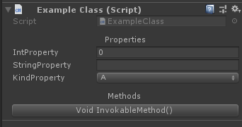
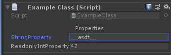
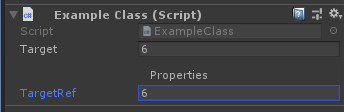

# InspectorExtender

Simple unity inspector extension with property & method supports.

It just works.

## Example

Only works in exposed public properties and methods. Basic properties and methods usage:

```csharp
public int IntProperty { get; set; }
public string StringProperty { get; set; }
public Kind KindProperty { get; set; }

public enum Kind {
    A, B, C,
}

public void InvokableMethod() {
    Debug.Log("20c6a7");
}
```



With advanced properties:

```csharp
private string _value;
public string StringProperty {
    get => _value;
    set => _value = $"__{value}__";
}

public int ReadonlyIntProperty { get; } = 42;
```



With ref getter:

```csharp
public int target;
public ref int TargetRef => ref target;
```



## How to use

Add [`InspectorExtender.cs`](/InspectorExtender.cs) file to any editor scripts directory